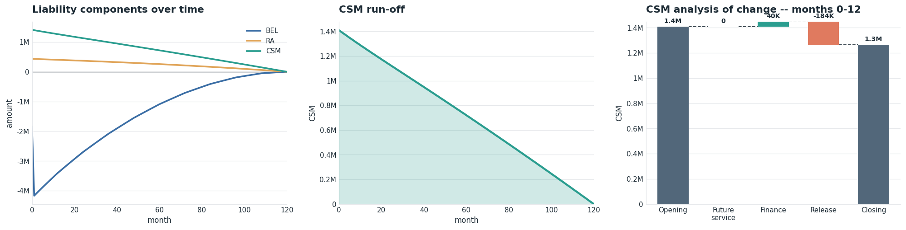

# fastcashflow

**Fast IFRS 17 valuation -- from cash flow projection to the disclosure.**



fastcashflow measures the insurance contract liability -- the best estimate
liability, the risk adjustment and the contractual service margin -- policy
by policy, under all three IFRS 17 measurement models.

- **Fast** -- numba-compiled kernels, built for seriatim (policy-by-policy)
  valuation at scale.
- **Complete** -- all three measurement models (GMM, PAA, VFA), reinsurance,
  stochastic valuation, and the period-close analysis of change.
- **Clear** -- readable code, teaching-quality docstrings, and built-in
  charts of every figure.
- **Open** -- free and open source, MPL-2.0 licensed.

```{toctree}
:maxdepth: 2
:caption: Contents

getting-started
concepts
api
```
